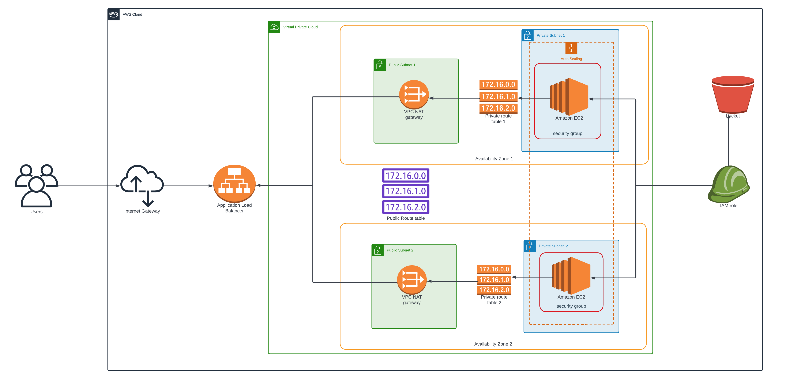

# Udacity *Advanced Cloud DevOps Nanodegree Program*
## 3- Deploy Infrastructure as Code (*IAC*)
## Table of Contents
* [Starter Code Starter Code and rubric](#starter-code)
* [Project 2 : Deploy a high-availability web app using CloudFormation](#project-2--deploy-a-high-availability-web-app-using-cloudformation)
* [Description](#description)
* [Architecture](#architecture)
* [Running The Project](#running-the-project)
* [Output](#output)
* [Files Included](#files-included)


## Starter Code
Starter Code Link for the project in this [Github repository](https://github.com/udacity/nd9991-c2-Infrastructure-as-Code-v1/tree/master/supporting_material). 

## Project 2 : Deploy a high-availability web app using CloudFormation

This project deploys web servers for a highly available web app using CloudFormation.  
It creates and deploys the infrastructure and application for an Instagram-like app from the ground up.  
Deployment begins with the networking components, followed by servers, security roles and software.  
The application code is deployed from the S3 bucket using appropriate role.  

### Description
Create a Launch Configuration in order to deploy four servers, two located in each of your private subnets.  
The launch configuration will be used by an auto-scaling group.  
You'll need two vCPUs and at least 4GB of RAM. The Operating System to be used is Ubuntu 18.  
So, choose an Instance size and Machine Image (AMI) that best fits this spec.  
Be sure to allocate at least 10GB of disk space so that you don't run into issues.

### Architecture


### Running the project:

1. To Execute network infrastructure stack Usage:
```shell
./run-networks.sh create
```


2. Upon step 1 successful completion, execute services infrastructure stack Usage: 

```shell
./run-services.sh create
 ```
 
 3. To Update network infrastructure stack Usage:
 
```shell
./run-networks.sh update
```
4. To Update services infrastructure stack Usage:

```shell
./run-services.sh update
```

5. To Delete Stack Usage:

```shell
./run-networks.sh delete
```

Or:

```shell
./run-services.sh delete
```

### Output
Services stack outputs the final website [`URL`](http://highl-webap-1eeldxiwypcg4-1932080337.us-east-1.elb.amazonaws.com/index.html).

# Web App Url
http://highl-webap-1eeldxiwypcg4-1932080337.us-east-1.elb.amazonaws.com/index.html

## Screenshot


### Files included:

- [`network.yaml`](./Deploy-a-high-availability-web-app-using-CloudFormation/network.yaml) - CloudFormation network infrastructure stack description.
- [`network-parameters.json`](./Deploy-a-high-availability-web-app-using-CloudFormation/network-parameters.json) - Parameters file for the network infrastructure stack
- [`services.yaml`](./Deploy-a-high-availability-web-app-using-CloudFormation/services.yaml) - CloudFormation services infrastructure stack description
- [`services-parameters.json`](./Deploy-a-high-availability-web-app-using-CloudFormation/services-parameters.json) - Parameters file for the services infrastructure stack
- [`run-networks.sh`](./Deploy-a-high-availability-web-app-using-CloudFormation/run-networks.sh) - bash script for managing network infrastructure stack
- [`run-services.sh`](./Deploy-a-high-availability-web-app-using-CloudFormation/run-services.sh) - bash script for managing services infrastructure stack
- [infrastructure-diagram-Lucidchart.png](./Deploy-a-high-availability-web-app-using-CloudFormation/infrastructure-diagram-Lucidchart.png) - infrastructure diagram
- [work progress screenshot](./Deploy-a-high-availability-web-app-using-CloudFormation/work%20progress) - Screenshots for work progress

## GitHub Link
https://github.com/mohamedelfal/Udacity-Advanced-Cloud-DevOps/
